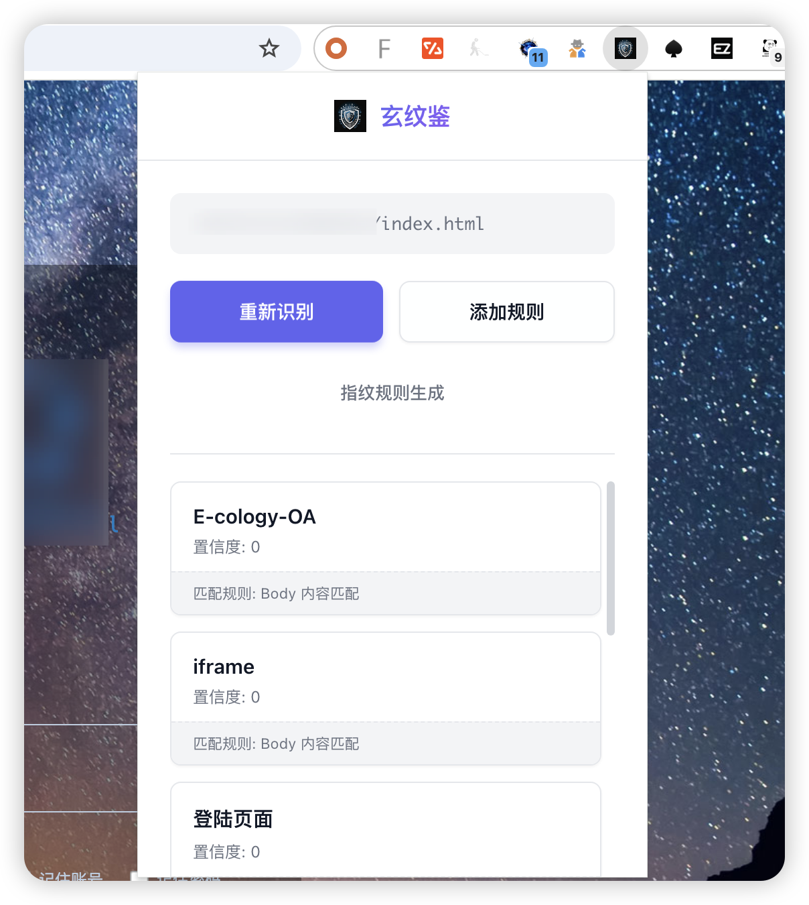

# 玄纹鉴 Chrome 扩展

基于 `finger_custom.json` 的网站指纹识别工具。

该项目是“山海计划”中的一环

关于山海计划：

山海计划，由**知攻善防实验室**发起的，安全工具链，致力于打造贴近攻防实战计划，构造完整的安全工具生态链。

## 功能特点

- 🎯 极简风格的界面设计
- 🔍 手动触发识别，避免不必要的 IO 开销
- 📊 支持 Body 内容和 HTTP Header 规则匹配
- 🛠️ 一键跳转指纹规则生成器

## 安装步骤

1. 在 Chrome 中加载扩展：
   - 打开 Chrome 浏览器
   - 访问 `chrome://extensions/`
   - 开启"开发者模式"（右上角）
   - 点击"加载已解压的扩展程序"
   - 选择本扩展的文件夹

2. 使用扩展：
   - 访问任意网站

   - 点击浏览器工具栏中的扩展图标

   - 点击"开始识别"按钮进行指纹识别

   - 点击"指纹规则生成"按钮可跳转到规则生成器页面

   - 查看识别结果

     

## 文件结构

```
.
├── manifest.json          # 扩展配置文件
├── popup.html            # 弹出窗口 HTML
├── popup.js              # 弹出窗口逻辑
├── content.js            # 内容脚本（执行识别）
├── styles.css            # 样式文件
├── finger_custom.json    # 指纹规则数据
└── icon*.png             # 图标文件（需要自行添加）
```

## 版权信息

公众号知攻善防实验室  
ChinaRan404

